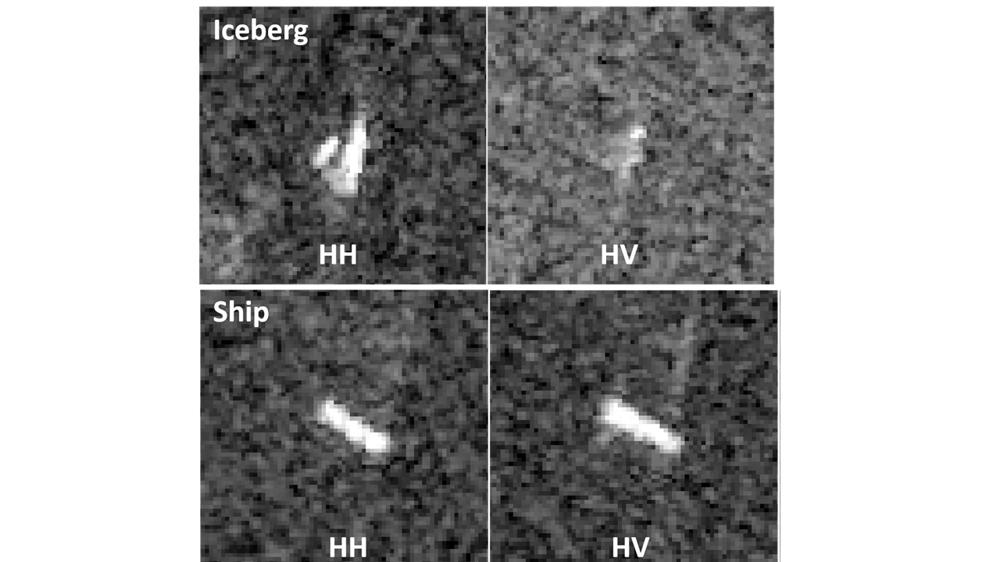

# Ship-Iceberg-Classification

In this project, a simple convolutional neural network is used to classify ship/icebergs from satellite radar images. A jupyter notebookand a python script file of the analysis can be found in the src folder. As shown in the notebook, the CNN has an accuracy of 87% in the classification task. 

## Background

Satellite radar works in much the same way as blips on a ship or aircraft radar. It bounces a signal off an object and records the echo, then that data is translated into an image. An object will appear as a bright spot because it reflects more radar energy than its surroundings, but strong echoes can come from anything solid - land, islands, sea ice, as well as icebergs and ships. The energy reflected back to the radar is referred to as backscatter.

When the radar detects an object, it can't tell an iceberg from a ship or any other solid object. The object needs to be analyzed for certain characteristics - shape, size and brightness - to find that out. The area surrounding the object, in this case ocean, can also be analyzed or modeled. Many things affect the backscatter of the ocean or background area. High winds will generate a brighter background. Conversely, low winds will generate a darker background. The Sentinel-1 satellite is a side looking radar, which means it sees the image area at an angle (incidence angle). Generally, the ocean background will be darker at a higher incidence angle. More advanced radars like Sentinel-1, can transmit and receive in the horizontal and vertical plane. Using this, you can get what is called a dual-polarization image.

The data used here comes with two channels: HH (transmit/receive horizontally) and HV (transmit horizontally and receive vertically). This can play an important role in the object characteristics, since objects tend to reflect energy differently. Easy classification examples are shown below. These objects can be visually classified. But in an image with hundreds of objects, this is very time consuming.

## Data

The data comes as NumPy arrays and has the follwing fields:

id - the id of the image

band_1, band_2 - the flattened image data. Each band has 75x75 pixel values in the list, so the list has 5625 elements. Note that these values are not the normal non-negative integers in image files since they have physical meanings - these are float numbers with unit being dB. Band 1 and Band 2 are signals characterized by radar backscatter produced from different polarizations at a particular incidence angle. The polarizations correspond to HH (transmit/receive horizontally) and HV (transmit horizontally and receive vertically). More background on the satellite imagery can be found here.

inc_angle - the incidence angle of which the image was taken. Note that this field has missing data marked as "na".

is_iceberg - the target variable, set to 1 if it is an iceberg, and 0 if it is a ship.

## Running the code

The model can be run either using the script_only.py or running the codeblocks in the Jupyter notebook. Please reach out to me if you need access to the data.
